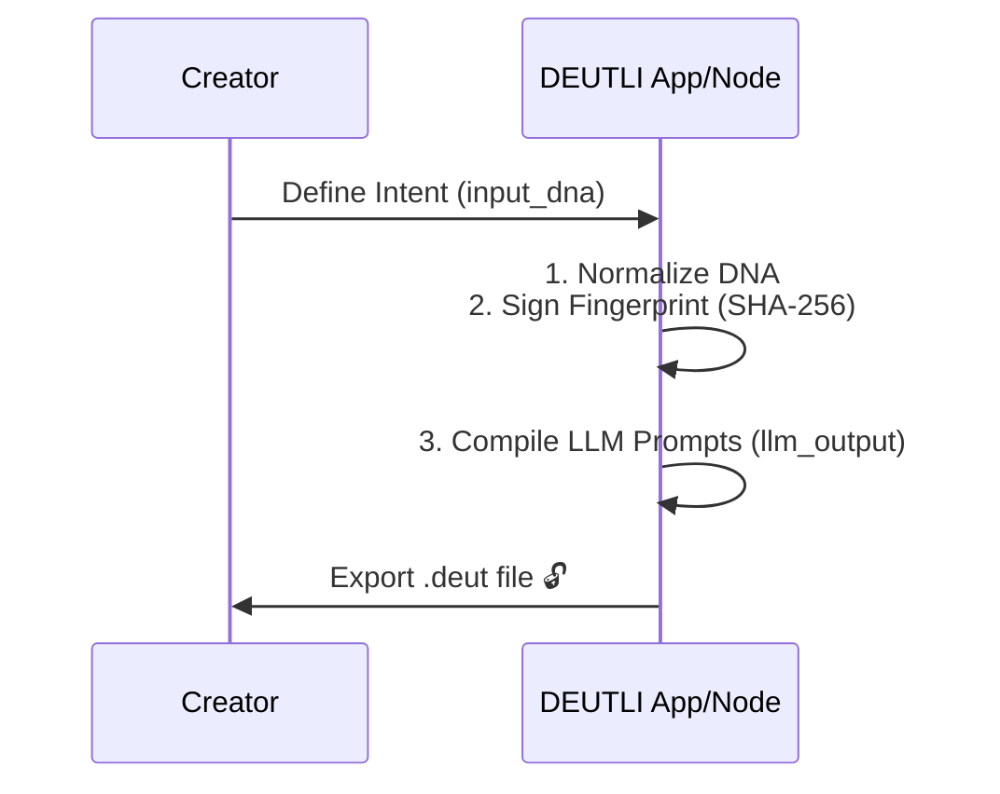

# 📄 DEUTLI Open Asset Format (.deut)

> Don't type. Snap it in.


## 1. The Digital Negative for Visual Arts
The `.deut` file is an industry-standard, structured JSON container for generative art. It acts as a digital negative, preserving the original creative intent (`input_dna`) alongside AI-generated multi-dialect outputs. It does not hardcode parameters for specific engines in its core, ensuring absolute cross-platform compatibility.

**Official Media Type:** `application/vnd.deut+json`  
**JSON Schema:** [https://deut.li/schemas/v1.1/schema.json](https://deut.li/schemas/v1.1/schema.json)

---

## 2. Structure Overview
The root object strictly follows this hierarchy:

1.  **meta**: Governance, versioning, and identification.
2.  **input_dna**: The immutable visual direction (The "Seed"). Pure semantic intent, no engine-specific technical noise.
3.  **llm_output**: Non-deterministic data compiled by the system (The "Fruit"). Includes standard dialects (`midjourney`, `natural`, `raw`).
4.  **vendor_data**: (Optional) Extensibility layer for third-party engines.
5.  **fingerprint**: Root-level SHA-256 integrity hash.

---

## 3. Workflow & Security


---

## 4. File Structure (The DNA) v1.1
A `.deut` file is a rigid JSON object. Here is a production example:

```json
{
  "meta": {
    "version": "1.1",
    "label": "BETA-1A074CC5",
    "userId": "guest_::1",
    "created_at": "2026-03-14T16:15:42.395Z"
  },
  "input_dna": {
    "text_fields": {
      "subject": "steam locomotive without wheels",
      "action": "flying",
      "context": "in the night sky",
      "intent": "global crisis"
    },
    "selectors": {
      "mediaCategory": "photo",
      "mediaStyle": "cinematic",
      "lighting": "hard",
      "framing": "portrait",
      "focus": "deep",
      "film": "velvia50"
    },
    "technical": {
      "aspectRatio": "16:9",
      "seed": "2238052541",
      "avoid": "cars, trees",
      "reference_url": ""
    }
  },
  "llm_output": {
    "midjourney": "/imagine prompt: A massive steam locomotive without wheels flying through a dark night sky, representing a global crisis, high-end cinematic production, harsh direct lighting, high contrast, sharp defined shadows, Fujifilm Velvia 50 slide film, vivid colors, deep blacks, 85mm lens, medium shot, subject dominance, f/16 aperture, deep depth of field --ar 16:9 --v 6.1 --stylize 250 --no cars, trees --seed 2238052541",
    "natural": "A high-end cinematic photograph captures a wheel-less steam locomotive soaring through the vast night sky, its presence evoking the weight of a global crisis. The scene is shot on Fujifilm Velvia 50 slide film, resulting in vivid colors and deep, rich blacks. Harsh direct lighting creates high contrast and sharp, defined shadows across the metallic hull of the train. Using an 85mm lens at f/16, the entire scene from the locomotive to the distant stars is in sharp focus, providing a sense of immense scale and atmospheric consistency. The image excludes cars and trees.",
    "raw": "steam locomotive, no wheels, flying, night sky, global crisis symbolism, photographic quality, optical fidelity, native resolution, uncompressed textures, authentic chromatic nuances, high-end cinematic production, anamorphic visual characteristics, tonal depth, atmospheric consistency, harsh direct lighting, high contrast, sharp defined shadows, 85mm lens, flattering perspective, medium shot, subject dominance, f/16 aperture, deep depth of field, Fujifilm Velvia 50, slide film, high saturation, vivid colors, deep blacks. Negative prompt: cars, trees"
  },
  "fingerprint": "1a074cc5ca4bd134118c34b2cdd92f01c61b0a81a5cb0f45c557c9ac1c7876bb"
}
```

---

## 5. Protocol Definitions

### 5.1 Fingerprint Protocol
The `fingerprint` is a **SHA-256 hash** of the `input_dna` object.
* **Purpose:** To verify that the creative intent hasn't been tampered with.
* **Calculation:** The `input_dna` object is canonicalized (keys sorted alphabetically) and hashed. 
* **Note:** `llm_output` and `vendor_data` are excluded from the fingerprint to allow for post-processing and engine updates without breaking provenance.

### 5.2 Vendor Data (Extensibility)
All engine-specific configurations **must** reside within the `vendor_data` block (if present). This is the official extension point for the industry, allowing tools to store internal states directly inside the `.deut` file without violating the clean semantic core of `input_dna`.

---
**Maintainer:** DEUTLI Engineering Team
