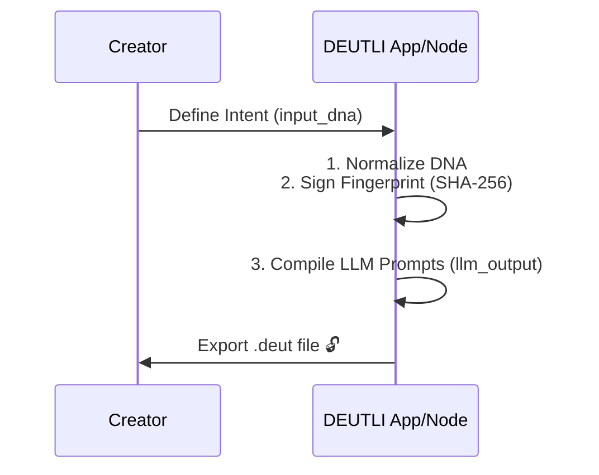

# 📄 DEUTLI Open Asset Format Specification (.deut)


## 1. Abstract
The `.deut` file is an industry-standard, structured JSON container for generative art. It acts as a **"Digital Negative"**, preserving the original creative intent (`input_dna`) alongside AI-generated outputs and platform-specific data.

**Official Media Type:** `application/vnd.deut+json`  
**JSON Schema:** [https://deut.li/schemas/v1.1/schema.json](https://deut.li/schemas/v1.1/schema.json)

---

## 2. Structure Overview
The root object follows a strict schema to ensure interoperability:

1.  **meta**: Governance, versioning, and authorship.
2.  **input_dna**: The immutable source parameters (The "Seed").
3.  **llm_output**: Non-deterministic data (The "Fruit").
4.  **vendor_data**: Extensibility layer for third-party engines (e.g., ComfyUI, Blender).
5.  **fingerprint**: Root-level SHA-256 integrity hash.

---

## 3. Workflow & Security

```mermaid
sequenceDiagram
    participant User as Creator
    participant App as DEUTLI App/Node
    User->>App: Define Intent (input_dna)
    App->>App: 1. Normalize DNA<br/>2. Sign Fingerprint (SHA-256)
    App->>App: 3. Compile LLM Prompts (llm_output)
    App->>User: Export .deut file 🔓
```

---

## 4. JSON Structure (v1.1)
```json
{
  "meta": {
    "version": "1.1",
    "userId": "clerk_id_string",
    "label": "Cinematic Nomad"
  },
  "input_dna": {
    "text_fields": {
      "subject": "Cybernetic traveler",
      "action": "walking through neon desert",
      "environment": "dystopian sunset",
      "atmosphere": "lonely, cinematic"
    },
    "selectors": {
      "mediaCategory": "photography",
      "lighting": "golden_hour",
      "framing": "wide_shot"
    },
    "technical": {
      "aspectRatio": "16:9",
      "seed": 425678,
      "avoid": "blurry, low quality"
    }
  },
  "llm_output": {
    "outputprompt": "Full AI optimized prompt here...",
    "enriched_fields": {
      "subject": "A highly detailed cybernetic traveler..."
    }
  },
  "vendor_data": {
    "comfy_raw_graph": {
      "nodes": [],
      "links": []
    }
  },
  "fingerprint": "8f97...64hex"
}
```

---

## 5. Protocol Definitions

### 5.1 Fingerprint Protocol
The `fingerprint` is a **SHA-256 hash** of the `input_dna` object.
* **Purpose:** To verify that the creative intent hasn't been tampered with.
* **Calculation:** The `input_dna` object is canonicalized (keys sorted alphabetically) and hashed. 
* **Note:** `llm_output` and `vendor_data` are excluded from the fingerprint to allow for post-processing and engine updates without breaking provenance.

### 5.2 Vendor Data (Extensibility)
The `vendor_data` field is the official extension point for the industry. It allows tools like **ComfyUI, Blender, or custom Stable Diffusion nodes** to store their internal states, raw graphs, or model weights directly inside the `.deut` file without violating the core standard.

---
**Maintainer:** DEUTLI Engineering Team
