# 📄 .deut File Format Specification
  

## 1. Abstract
The `.deut` file is a structured JSON container for generative art assets. It serves as a "Digital Negative," storing source parameters (`input_dna`) alongside compiled multi-dialect outputs. It features cryptographic fingerprinting for provenance verification.

## 2. Structure Overview
Root object must contain:
1.  **meta**: Metadata and Security.
2.  **input_dna**: Non-destructive source parameters.
3.  **outputs**: Compiled prompts for AI engines.

## 3. Workflow & Security

```mermaid
sequenceDiagram
    participant User as Client
    participant Server as Deut.li Server
    User->>Server: Generate (Input Params)
    Server->>Server: 1. Sign Fingerprint (SHA-256)<br/>2. Compile Dialects (MJ, Natural, Raw)<br/>3. Encrypt JSON (AES-256)
    Server->>User: Encrypted Blob 🔒
    User->>Server: UNLOCK (Payment)
    Server->>User: Decrypted JSON 🔓 (.deut file)
```


## 4. JSON Structure
```json
{
  "meta": {
    "version": "1.1",
    "generator": "deut.li-web",
    "created_at": 1700000000,
    "userId": "user_id_string",
    "fingerprint": "sha256_hash_string"
  },
  "input_dna": {
    "subject": "String",
    "action": "String",
    "environment": "String",
    "atmosphere": "String",
    "avoid": "String",
    "reference": "URL or null",
    "selectors": {
      "mediaCategory": "Slug",
      "mediaStyle": "Slug",
      "lighting": "Slug",
      "framing": "Slug",
      "focus": "Slug",
      "film": "Slug",
      "ar": "String",
      "seed": "String"
    }
  },
  "outputs": {
    "midjourney": "String (--v 6.1)",
    "natural": "String (Natural Language)",
    "raw": "String (Tags)"
  }
}
```

## 5. Fingerprint Protocol
The fingerprint is calculated by hashing the concatenated lowercase values of `input_dna`. Order: `userId|subject|action|environment|atmosphere|avoid|mediaCategory|mediaStyle|lighting|framing|focus|film|ar|seed`
